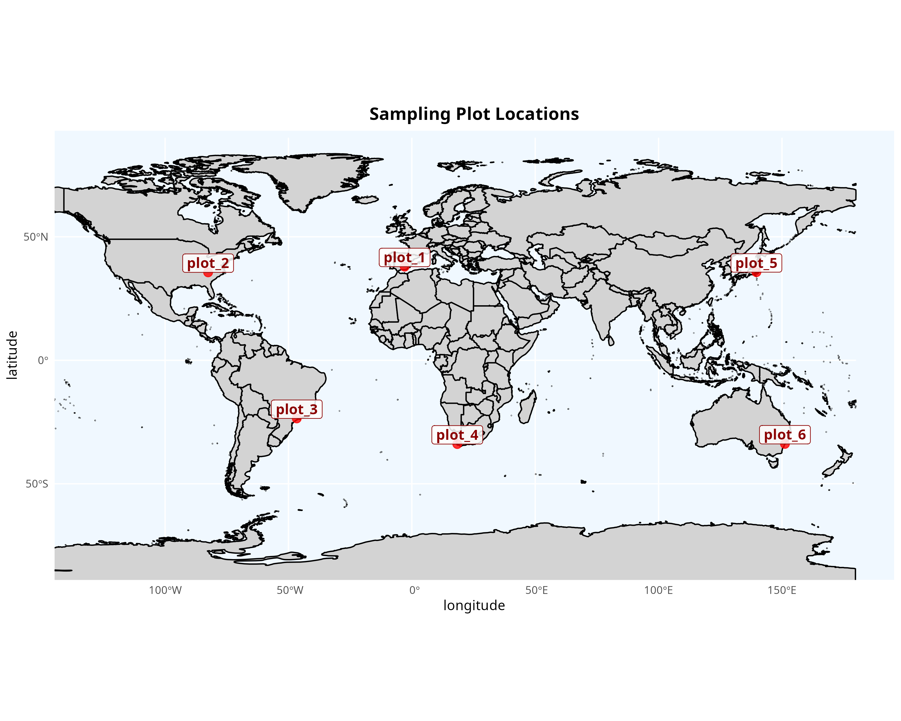
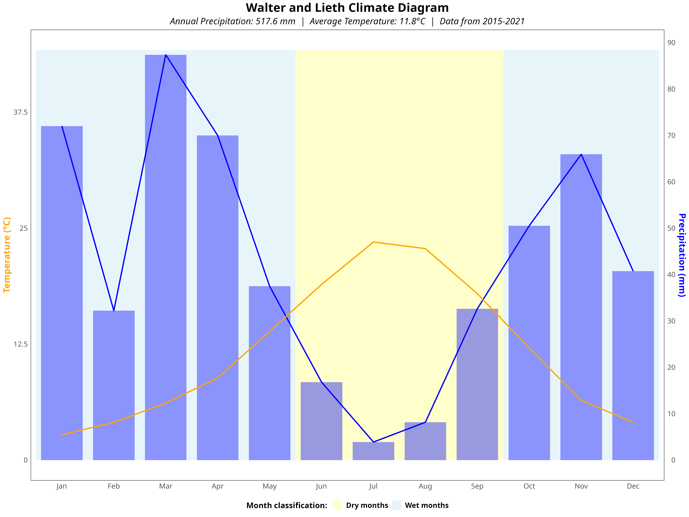
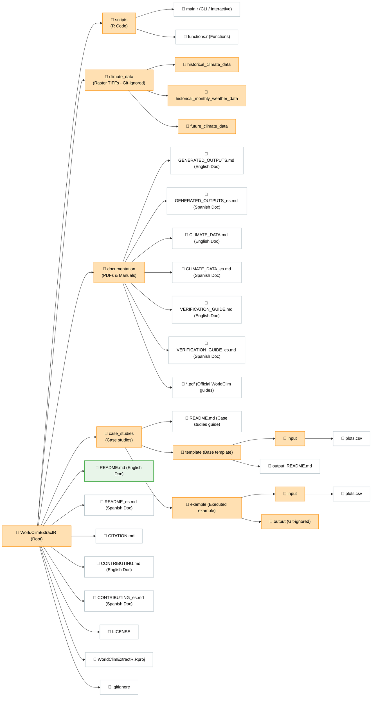

# WorldClimExtractR

[](https://www.r-project.org/)
[](LICENSE)
[](https://www.worldclim.org/)
[](https://www.worldclim.org/data/cmip6.html)
[](#-visual-showcase--generated-outputs)

---

***This document is also available in 🇪🇸 [Spanish (Español)](README_es.md).***

**WorldClimExtractR** is a lightweight, parameterized R tool to extract, process, and summarize historical and future (CMIP6) WorldClim climate data based on geographic coordinates anywhere in the world.

---

## 🎨 Visual showcase & generated outputs

Here is an illustrative example using 6 coordinate plots located worldwide, showing both the spatial location check and the corresponding climate summary graphs:

| 📍 Plot Geographic Verification Map | 📊 Auto-Generated Walter-Lieth Climodiagram |
| :---: | :---: |
|  |  |
| *Scale-adaptive map showing point location check (regional/European/global).* | *Monthly temperature and precipitation patterns for a selected historical period.* |

---

## 📊 Tabular data previews

Below is a preview of the structured tabular datasets automatically produced in `CSV` and `XLSX` (consolidated spreadsheet) formats:

### A. Monthly historical data (`historical_monthly_weather_data.csv`)
First few rows showing the extracted monthly climate variables (e.g., precipitation, temperature extremes, and average):

| id | latitude | longitude | elev | year | month | prec | tmax | tmin | tavg |
| :--- | :---: | :---: | :---: | :---: | :---: | :---: | :---: | :---: | :---: |
| plot_1 | 37.903222 | -2.911167 | 1275 | 2015 | 01 | 48.5 | 8.0 | -3.0 | 2.5 |
| plot_1 | 37.903222 | -2.911167 | 1275 | 2015 | 02 | 56.3 | 7.0 | -2.0 | 2.5 |
| plot_1 | 37.903222 | -2.911167 | 1275 | 2015 | 03 | 96.7 | 12.0 | 0.0 | 6.0 |

### B. Historical weather period summary (`historical_period_weather_data.csv`)
Aggregated weather values and calculated indices (such as the Martonne Aridity Index) representing the selected historical time range:

| id | period | month | tmin | tmax | tavg | prec | martonne |
| :--- | :---: | :---: | :---: | :---: | :---: | :---: | :---: |
| plot_1 | 2015_2021 | annual | 5.5 | 18.1 | 11.8 | 517.6 | 23.77 |
| plot_2 | 2015_2021 | annual | 8.2 | 20.8 | 14.5 | 1392.9 | 56.81 |

### C. Future climate period projections (`future_period_climatic_data.csv`)
CMIP6 projected averages and ranges (minimum/maximum values) grouped by decade/period and SSP scenario:

| id | model | file_ssp | period | tmin | tmax | tavg | prec | martonne |
| :--- | :---: | :---: | :---: | :---: | :---: | :---: | :---: | :---: |
| plot_1 | MIROC6 | 1 | 2021-2040 | 7.1 | 20.0 | 13.6 | 495.0 | 21.02 |
| plot_1 | MIROC6 | 1 | 2041-2060 | 7.5 | 20.5 | 14.0 | 490.0 | 20.40 |
| plot_1 | MIROC6 | 2 | 2021-2040 | 7.1 | 19.8 | 13.5 | 502.0 | 21.39 |

> [!NOTE]
> Future climate tables include additional min/max bounds columns (`tmin_min`, `tmax_max`, etc.) to provide uncertainty ranges for each projection period.

---

## Table of contents

- [Features](#features)
- [Requirements](#requirements)
- [Repository structure](#repository-structure)
- [Full usage example](#full-usage-example)
- [Command line interface (CLI) options](#command-line-interface-cli-options)
- [Geospatial layers configuration](#geospatial-layers-configuration)
- [Citations and references](#citations-and-references)
- [License](#license)

---

## ✨ Features

* 🌍 **Coordinate Climate Extraction**: Retrieves bioclimatic, elevation, and historical monthly temperature and precipitation data worldwide.
* 📊 **Walter-Lieth Climate Diagrams**: Generates standardized climate diagrams for historical and future periods in English or Spanish.
* ⚙️ **CLI & HPC Ready**: A parameterized script compatible with terminal environments using `optparse`, allowing local and HPC execution without internal code modifications.
* 📁 **Consolidated Formats**: Exports results to individual CSVs, a multi-sheet Excel workbook (`.xlsx`), a spatial vector file (`.geojson`), a metadata report with citations, and saves the R session environment (`.RData`).
* 🎛️ **Modular Output Toggles**: Run only the sections you need (historical, future, maps, or climodiagrams) using explicit execution flags.

---
## 📦 Requirements

### System dependencies
Ensure you have R installed (version `>= 4.0.0`) along with system libraries required by spatial dependencies like `sf`:

```bash
# Required system dependencies on Ubuntu / Debian
sudo apt-get install libgdal-dev libgeos-dev libproj-dev libudunits2-dev
```

### R packages
The main script automatically checks and installs any missing R packages:
* `eurostat`
* `giscoR`
* `openxlsx`
* `optparse`
* `raster`
* `sf`
* `tidyverse`

### Climate data (.tif)
Users must download all the required `.tif` files to retrieve climate data, which can be done from the official [WorldClim](https://www.worldclim.org/data/index.html) website. To learn how to name and organize these layers, please refer to the [Geospatial Data Setup Guide (CLIMATE_DATA.md)](documentation/CLIMATE_DATA.md).

---

## 📂 Repository structure

The repository maintains a clean structure, excluding large raster layers and user study outputs from version control:



---

## 🚀 Full usage example

To run a test case using the provided template case study:

### Step 1: configure your input coordinates
Edit the input CSV file at `case_studies/template/input/plots.csv`, specifying the point identifiers (*id*), coordinates (*latitude* and *longitude*, CRS = WGS84), and the historical years of interest to extract (*hst_start_year* and *hst_end_year*; defaults to the 1990-2020 period).

> [!IMPORTANT]
> The input coordinates must be strictly in WGS84 decimal format (longitude/latitude). Automatic on-the-fly conversion of UTM coordinates is no longer supported.

```csv
id,latitude,longitude,hst_start_year,hst_end_year
plot_1,37.90322,-2.91116,2015,2021
plot_2,42.60910,-4.77280,1990,2020
```

### Step 2: organize your raster (.tif) files
Download and arrange the WorldClim raster files according to the conventions explained in [CLIMATE_DATA.md](documentation/CLIMATE_DATA.md). You can store them in:
1. **The project directory** (default): Place the three subfolders of data inside `climate_data/` in the root folder.
2. **An external drive or custom folder**: Place the climate data structure elsewhere and pass its path using the `--data` flag (recommended to avoid taking up local storage space).

### Step 3: run the script from the terminal
Open your terminal and run the main script. You can view all available parameters and flags in the [Command Line Interface (CLI) Options](#⚙️-command-line-interface-cli-options) section (also available via the `Rscript scripts/main.r --help` command):

```bash
# Basic run (looking for TIFF files in the climate_data project folder)
Rscript scripts/main.r --case "template" --basedir "." --lang "es" --hst_var "elev" --fut_var "clim" --ssp "all"

# Run specifying an external path where TIFF files are stored
Rscript scripts/main.r --case "template" --basedir "." --data "/media/user/ExternalDrive/climate_data/" --lang "en"
```

### Step 4: inspect generated outputs
Once execution completes, find your output files in `case_studies/template/output/` (or the equivalent `output/` directory of your case study if you duplicated the template for another project). To visually verify geographical coordinates and Walter-Lieth graphs, consult the [Results Verification Guide (VERIFICATION_GUIDE.md)](documentation/VERIFICATION_GUIDE.md).

Outputs are grouped as follows:

* **`data/`**:
  * `historical_climate_data.csv`: Historical baseline climate data (WorldClim 1970-2000).
  * `historical_monthly_weather_data.csv`: Historical monthly weather dataset (precipitation, temperatures).
  * `historical_year_weather_data.csv`: Historical annual weather summaries and calculated Martonne Aridity Index.
  * `historical_period_weather_data.csv`: Averaged weather values representing the entire historical range.
  * `future_climate_data.csv` & `future_period_climatic_data.csv`: CMIP6 future climate projections (MIROC6 model).
  * `all_output_data.xlsx`: Consolidated multi-sheet Excel workbook with all tables.
  * `plots_extracted.geojson`: Geospatial vector file with coordinates and period summaries.
  * `citations_and_metadata.md`: Markdown document detailing script options and references to cite.
  * `environment.rdata`: R environment snapshot for further custom analysis.
* **`maps/`**:
  * Location maps containing plot points with their IDs plotted for visual verification (national, European, and regional scales).
* **`climodiagrams/`**:
  * **`historical/`**: Historical Walter-Lieth diagrams for each plot.
  * **`future/`**: Projections sorted by SSP scenarios and decades (e.g., `plot_1_future_ssp_2_period_2021-2040_climodiagram_walter_lieth_en.png`).

---

## ⚙️ Command line interface (CLI) options

The `scripts/main.r` script supports the following CLI arguments:

| Short Flag | Long Flag | Type | Default | Description |
| :--- | :--- | :--- | :--- | :--- |
| `-c` | `--case` | `character` | `template` | Subfolder name inside `case_studies/` |
| `-b` | `--basedir` | `character` | `getwd()` | Root directory path of the project codebase |
| `-d` | `--data` | `character` | `NULL` | Path to alternative WorldClim raster data folder |
| `-l` | `--lang` | `character` | `en` | Language for charts and maps (`en` or `es`) |
| `-e` | `--hst_var` | `character` | `elev` | Starting historical variable to extract (`elev`, `bio`, `clim`) |
| `-v` | `--hst_bio` | `integer` | `NULL` | Specific historical bioclimatic variable index (1-19) |
| `-f` | `--fut_var` | `character` | `clim` | Future CMIP6 variable to extract (`all` [generates climodiagrams], `bio` [bioclimatic variables only, skips climodiagrams], `clim` [monthly climate weather only, generates climodiagrams]) |
| `-s` | `--ssp` | `character` | `all` | Future SSP scenario (`1`, `2`, `3`, `5`, or `all`) |
| | `--hst_climate` | `logical` | `TRUE` | Enable/disable historical baseline climate extraction |
| | `--hst_weather` | `logical` | `TRUE` | Enable/disable historical monthly weather extraction |
| | `--future` | `logical` | `TRUE` | Enable/disable future projection extraction |
| | `--map` | `logical` | `TRUE` | Enable/disable plot verification map generation |
| | `--climodiagram`| `logical` | `TRUE` | Enable/disable Walter-Lieth climate diagram generation |

### Advanced usage example
```bash
# Load data from external storage, extract BIO3 bioclimatic variable, and disable future projections
Rscript scripts/main.r --case "my_project" --data "/media/user/HD" --hst_var "bio" --hst_bio 3 --future FALSE
```

---

## 📂 Geospatial layers configuration

To learn more about downloading, decade structure, and naming conventions for Earth's precipitation, temperature, and CMIP6 TIFF layers, check:
* [Geospatial Data Setup Guide (CLIMATE_DATA.md)](documentation/CLIMATE_DATA.md)

---

## 🤝 Citations and references

When publishing scientific papers or reports using data generated by this tool, please cite both the repository and the original data sources:

* **WorldClimExtractR (this repository)**: Vázquez-Veloso, A. (2026). WorldClimExtractR: A parameterized R tool for historical and future CMIP6 WorldClim climate data extraction. GitHub repository: https://github.com/aitorvv/WorldClimExtractR
* **WorldClim 2.1 Baseline**: Fick, S.E. and R.J. Hijmans, 2017. WorldClim 2: new 1km spatial resolution climate surfaces for global land areas. *International Journal of Climatology* 37 (12): 4302-4315.
* **Monthly Weather Data**: Harris, I., Osborn, T.J., Jones, P.D., Lister, D.H. 2020. Version 4 of the CRU TS monthly high-resolution gridded multivariate climate dataset. *Scientific Data* 7: 109.
* **Future Projections (CMIP6)**: Petrie, R., et al. 2021. Coordinating an operational data distribution network for CMIP6 data. *Geoscientific Model Development*, 14(1), 629-644.
* **Martonne Aridity Index**: Martonne, E. de. 1926. L’indice d’aridité. *Bulletin de l’Association de Géographes Français*, 3, 3–5.

---

## 📄 License

This project is licensed under the **MIT License** - see the [LICENSE](LICENSE) file for details.
