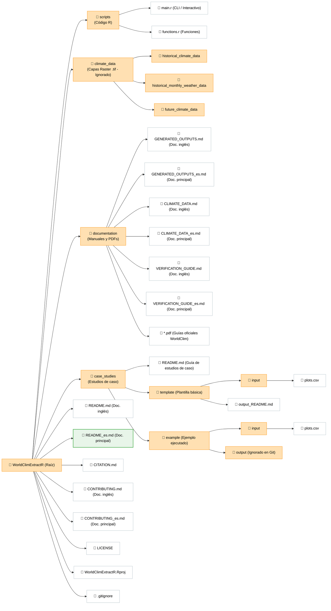

# WorldClimExtractR

[](https://www.r-project.org/)
[](LICENSE)
[](https://www.worldclim.org/)
[](https://www.worldclim.org/data/cmip6.html)
[](#-galería-visual-y-resultados-generados)

---

***Este documento también está disponible en 🇬🇧 [inglés (English)](README.md).***

**WorldClimExtractR** es una herramienta ágil y parametrizada en R para extraer, procesar y resumir datos climáticos históricos y de futuras proyecciones (CMIP6) de WorldClim a partir de coordenadas geográficas en cualquier lugar del mundo.

---

## 🎨 Galería visual y resultados generados

A continuación se muestra un ejemplo ilustrativo con 6 parcelas de prueba distribuidas por el mundo, mostrando tanto la verificación espacial de la localización como los gráficos de síntesis climática obtenidos:

| 📍 Mapa de Verificación Geográfica | 📊 Climograma Walter-Lieth Autogenerado |
| :---: | :---: |
|  |  |
| *Mapa adaptativo a la escala del estudio mostrando los puntos de muestreo (regional/europea/global).* | *Evolución de temperatura y precipitación mensual para el periodo histórico seleccionado.* |

---

## 📊 Previsualización de datos tabulares

A continuación se expone una muestra de la estructura de las tablas de salida que la herramienta genera automáticamente en formatos `CSV` y `XLSX` (libro Excel unificado):

### A. Datos de clima base histórico (`historical_climate_data.csv`)
Variables de clima base de referencia a largo plazo (ej. índices bioclimáticos o elevación) extraídas para el periodo de referencia estándar 1970-2000:

| id | latitude | longitude | period | bio_3 |
| :--- | :---: | :---: | :---: | :---: |
| plot_1 | 37.903222 | -2.911167 | 1970-2000 | 37.8 |
| plot_2 | 35.597500 | -82.555400 | 1970-2000 | 40.2 |

> [!NOTE]
> Las columnas varían dinámicamente según el parámetro de variable de clima base histórico seleccionado (`--hst_var`).

### B. Datos meteorológicos mensuales históricos (`historical_monthly_weather_data.csv`)
Primeras filas con las observaciones meteorológicas mensuales extraídas (precipitación, temperaturas extremas y medias) desde CRU-TS:

| id | latitude | longitude | year | month | prec | tmax | tmin | tavg |
| :--- | :---: | :---: | :---: | :---: | :---: | :---: | :---: | :---: |
| plot_1 | 37.903222 | -2.911167 | 2015 | 01 | 48.5 | 8 | -3 | 2.5 |
| plot_1 | 37.903222 | -2.911167 | 2015 | 02 | 56.3 | 7 | -2 | 2.5 |
| plot_1 | 37.903222 | -2.911167 | 2015 | 03 | 96.7 | 12 | 0 | 6.0 |

### C. Resumen meteorológico del periodo histórico (`historical_period_weather_data.csv`)
Valores meteorológicos consolidados e índices calculados (ej. Índice de Aridez de Martonne anual) para el rango temporal completo:

| id | period | month | tmin | tmax | tavg | prec | martonne |
| :--- | :---: | :---: | :---: | :---: | :---: | :---: | :---: |
| plot_1 | 2015_2021 | 01 | -2.3 | 7.7 | 2.7 | 72.0 | NA |
| plot_1 | 2015_2021 | annual | 5.5 | 18.1 | 11.8 | 517.6 | 23.77 |

> [!NOTE]
> La tabla de resumen del periodo contiene columnas adicionales de rangos límites (`tmin_min`, `tmax_max`, etc.) para reflejar los límites de variación temporal.

### D. Proyecciones climáticas de futuro (`future_period_climate_data.csv`)
Promedios proyectados bajo modelos CMIP6 y rangos (mínimo/máximo) agrupados por periodo/década y escenario SSP:

| id | model | ssp | period | tmin | tmax | tavg | prec | martonne |
| :--- | :---: | :---: | :---: | :---: | :---: | :---: | :---: | :---: |
| plot_1 | MIROC6 | 2 | 2021-2040 | 7.1 | 19.8 | 13.5 | 502.0 | 21.39 |
| plot_1 | MIROC6 | 2 | 2041-2060 | 7.7 | 20.8 | 14.2 | 484.0 | 19.96 |

> [!NOTE]
> Las tablas de proyecciones futuras contienen columnas adicionales de rangos límites (`tmin_min`, `tmax_max`, etc.) para reflejar los márgenes de incertidumbre de cada periodo proyectado.

---

## Índice

- [Características](#características)
- [Requisitos](#requisitos)
- [Estructura del repositorio](#estructura-del-repositorio)
- [Ejemplo de uso completo](#ejemplo-de-uso-completo)
- [Opciones de ejecución por consola (CLI)](#opciones-de-ejecución-por-consola-cli)
- [Configuración de capas geodésicas](#configuración-de-capas-geodésicas)
- [Citas y referencias](#citas-y-referencias)
- [Licencia](#licencia)

---

## ✨ Características

* 🌍 **Extracción de Coordenadas Climáticas**: Obtención de variables bioclimáticas, elevación e históricos de temperatura y precipitación mundial.
* 📊 **Climogramas de Walter-Lieth**: Generación automática de diagramas climáticos para periodos históricos y futuros en inglés o español.
* ⚙️ **Preparado para CLI y HPC**: Script parametrizado compatible con terminal mediante `optparse`, permitiendo ejecuciones tanto en local como en un servidor sin modificar el código interno.
* 📁 **Consolidación en XLSX y RData**: Exportación automática de los resultados a ficheros CSV independientes, a un único libro Excel multi-pestaña (`.xlsx`) y guardado del entorno de ejecución de R (`.RData`).

---
## 📦 Requisitos

### Dependencias del sistema
Asegúrese de contar con R instalado (versión `>= 4.0.0`) y las librerías del sistema necesarias para dependencias geoespaciales como `sf`:

```bash
# Dependencias necesarias en Ubuntu / Debian
sudo apt-get install libgdal-dev libgeos-dev libproj-dev libudunits2-dev
```

### Paquetes de R
El script principal verifica e instala automáticamente las librerías de R faltantes:
* `eurostat`
* `giscoR`
* `openxlsx`
* `optparse`
* `raster`
* `sf`
* `tidyverse`

### Datos climáticos (.tif)
Es necesario descargar todos los archivos `.tif` necesarios para obtener los datos, lo cual puede hacer desde la web oficial de [WorldClim](https://www.worldclim.org/data/index.html). Para conocer la estructura de carpetas y nomenclatura de estas capas, consulte la [Guía de configuración de datos espaciales (CLIMATE_DATA_es.md)](documentation/CLIMATE_DATA_es.md).

---

## 📂 Estructura del repositorio

El repositorio mantiene una estructura limpia de Git, excluyendo del control de versiones los datasets espaciales pesados y los casos de ejecución de los usuarios:



---

## 🚀 Ejemplo de uso completo

Para ejecutar un caso de prueba utilizando la plantilla suministrada:

### Paso 1: configurar las coordenadas de entrada
Edite el archivo de entrada en `case_studies/template/input/plots.csv` indicando el identificador del punto (*id*), sus coordenadas geográficas (*latitude* y *longitude*, SRC = WGS84), y los años históricos de los que se quiere extraer la información (*hst_start_year* y *hst_end_year*; por defecto se elige el periodo 1990-2020).

> [!IMPORTANT]
> Las coordenadas de entrada deben estar estrictamente en formato decimal WGS84 (longitud/latitud). Ya no se admite la conversión automática al vuelo de coordenadas UTM.

```csv
id,latitude,longitude,hst_start_year,hst_end_year
plot_1,37.90322,-2.91116,2015,2021
plot_2,42.60910,-4.77280,1990,2020
```

### Paso 2: organizar los archivos raster (.tif)
Asegúrese de haber descargado y ubicado las capas de WorldClim siguiendo el esquema detallado en [CLIMATE_DATA_es.md](documentation/CLIMATE_DATA_es.md). Puede organizarlas en:
1. **El directorio del proyecto** (ubicación por defecto): Colocando las tres subcarpetas de datos dentro de `climate_data/` en la raíz.
2. **Un disco externo o directorio alternativo**: Almacenando la estructura de carpetas climáticas en una ubicación externa y pasándole la ruta al script mediante el flag `--data` (evitando ocupar espacio en el disco principal).

### Paso 3: ejecutar el script por consola
Abra su terminal y ejecute el script principal. Puede consultar los parámetros y flags disponibles en la sección de [Opciones de Ejecución por Consola (CLI)](#⚙️-opciones-de-ejecución-por-consola-cli) (también visibles con el comando `Rscript scripts/main.r --help`):

```bash
# Ejecución básica (buscando las capas TIFFs en la carpeta climate_data del proyecto)
# Establezca el directorio de trabajo en R (setwd("~/WorldClimExtractR")) antes de ejecutar o use cd desde consola
# Rscript scripts/main.r --case "template" --basedir "." --lang "es" --hst_var "elev" --fut_var "clim" --ssp "all"

# Ejecución indicando una ruta externa alternativa donde están guardados los TIFFs
Rscript scripts/main.r --case "template" --basedir "." --data "/ruta/a/mi/disco_externo/climate_data/" --lang "es"
```

### Paso 4: resultados generados
Tras la finalización del script, consulte la carpeta `case_studies/template/output/` (o la carpeta `output/` equivalente de su caso de estudio si ha duplicado la plantilla para otro caso). Para verificar visualmente la exactitud geográfica y de los climogramas, consulte la [Guía de Verificación de Resultados (VERIFICATION_GUIDE_es.md)](documentation/VERIFICATION_GUIDE_es.md).

Los resultados se distribuyen en las siguientes carpetas:

* **`data/`**:
  * `historical_climate_data.csv`: Datos climáticos de referencia histórica (WorldClim 1970-2000).
  * `historical_monthly_weather_data.csv`: Dataset meteorológico mensual histórico (precipitación, temperaturas mínimas, máximas y medias).
  * `historical_year_weather_data.csv`: Sumarios meteorológicos anuales calculados e índice de aridez de Martonne.
  * `historical_period_weather_data.csv`: Resumen meteorológico promediado de todo el periodo histórico.
  * `future_climate_data.csv` & `future_period_climate_data.csv`: Extracciones de las proyecciones climáticas del GCM MIROC6 bajo los escenarios SSP.
  * `all_output_data.xlsx`: Libro Excel multi-pestaña consolidando todas las tablas anteriores.
  * `plots_extracted.geojson`: Capa vectorial con los puntos extraídos y sus sumarios de periodo para uso en GIS.
  * `citations_and_metadata.md`: Documento con metadatos de ejecución e instrucciones bibliográficas de citación.
  * `environment.rdata`: Imagen de R con todas las variables cargadas para análisis posterior en R.
* **`maps/`**:
  * Contiene los mapas de verificación de localización de parcelas a escala de la zona de estudio (ej. `location_map_es.png`).
* **`climodiagrams/`**:
  * **`historical/`**: Ficheros PNG con los diagramas climáticos Walter-Lieth del histórico de cada parcela.
  * **`future/`**: Diagramas clasificados por escenarios SSP y décadas proyectadas (ej. `plot_1_future_ssp_2_period_2021-2040_climodiagram_walter_lieth_es.png`).

---

## ⚙️ Opciones de ejecución por consola (CLI)

El script `scripts/main.r` expone las siguientes opciones mediante argumentos:

| Flag corto | Flag largo | Tipo | Por defecto | Descripción |
| :--- | :--- | :--- | :--- | :--- |
| `-c` | `--case` | `character` | `template` | Nombre del subdirectorio en `case_studies/` |
| `-b` | `--basedir` | `character` | `getwd()` | Ruta raíz absoluta o relativa del código del proyecto |
| `-d` | `--data` | `character` | `NULL` | Directorio raíz alternativo de capas TIFF [por defecto: igual a basedir] |
| `-l` | `--lang` | `character` | `en` | Idioma de los climogramas y mapas (`en` o `es`) |
| `-e` | `--hst_var` | `character` | `elev` | Variable histórica inicial (`elev`, `bio`, `prec`, `srad`, `tavg`, `tmax`, `tmin`, `vapr`, `wind`, `all`) |
| `-v` | `--hst_bio` | `integer` | `NULL` | Número de bioclimático histórico a extraer (1-19) |
| `-f` | `--fut_var` | `character` | `clim` | Variables futuras a procesar (`all` [genera climogramas], `bio` [solo bioclimáticos, omite climogramas], `clim` [solo clima mensual, genera climogramas]) |
| `-s` | `--ssp` | `character` | `all` | Escenarios SSP futuros (`1`, `2`, `3`, `4`, `5` o `all`) |
| | `--hst_climate` | `logical` | `TRUE` | Activar/desactivar la extracción del clima base histórico |
| | `--hst_weather` | `logical` | `TRUE` | Activar/desactivar la extracción del tiempo meteorológico mensual histórico |
| | `--future` | `logical` | `TRUE` | Activar/desactivar la extracción de proyecciones futuras |
| | `--map` | `logical` | `TRUE` | Activar/desactivar la generación de mapas de verificación |
| | `--climodiagram`| `logical` | `TRUE` | Activar/desactivar la generación de climogramas Walter-Lieth |

### Ejemplo de uso avanzado
```bash
# Carga de datos desde disco externo, extrayendo variable bioclimática BIO3 de base
Rscript scripts/main.r --case "mi_proyecto" --data "/media/usuario/DISCO" --hst_var "bio" --hst_bio 3 --fut_var "all"
```

---


## 📂 Configuración de capas geodésicas

Para comprender la estructura, codificación de nombres y links de descarga directa de los archivos `.tif` de precipitaciones, temperaturas y modelos CMIP6 de la Tierra, consulte el documento:
* [Guía de configuración de datos espaciales (CLIMATE_DATA_es.md)](documentation/CLIMATE_DATA_es.md)

---

## 🤝 Citas y referencias

Cuando publique trabajos científicos que utilicen datos procesados por esta herramienta, por favor cite tanto el repositorio como los trabajos de referencia correspondientes:

* **WorldClimExtractR (este repositorio)**: Vázquez-Veloso, A. (2026). WorldClimExtractR: A parameterized R tool for historical and future CMIP6 WorldClim climate data extraction. GitHub repository: https://github.com/aitorvv/WorldClimExtractR
* **WorldClim 2.1 Baseline**: Fick, S.E. and R.J. Hijmans, 2017. WorldClim 2: new 1km spatial resolution climate surfaces for global land areas. *International Journal of Climatology* 37 (12): 4302-4315.
* **Monthly Weather Data**: Harris, I., Osborn, T.J., Jones, P.D., Lister, D.H. 2020. Version 4 of the CRU TS monthly high-resolution gridded multivariate climate dataset. *Scientific Data* 7: 109.
* **Proyecciones Futuras (CMIP6)**: Petrie, R., et al. 2021. Coordinating an operational data distribution network for CMIP6 data. *Geoscientific Model Development*, 14(1), 629-644.
* **Índice de Martonne**: Martonne, E. de. 1926. L’indice d’aridité. *Bulletin de l’Association de Géographes Français*, 3, 3–5.

---

## 📄 Licencia

Este proyecto está licenciado bajo la **Licencia MIT** - consulte el archivo [LICENSE](LICENSE) para más detalles.
