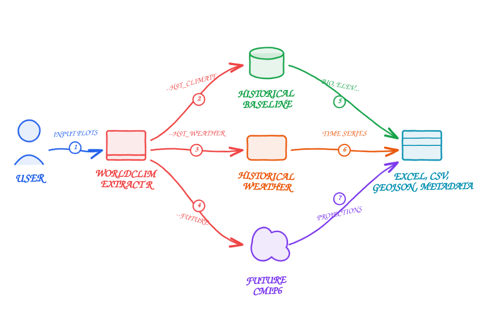

# WorldClimExtractR: Casos de Uso Comunes

Esta guía proporciona ejemplos de cómo ejecutar la herramienta `WorldClimExtractR` dependiendo de tus necesidades específicas de investigación.



> **Nota:** Planeamos lanzar una Interfaz Gráfica de Usuario (GUI) sencilla en el futuro para permitir ejecutar estas extracciones mediante botones en lugar de comandos. Por ahora, la interfaz de línea de comandos proporciona control total sobre el proceso de extracción.

---

## Caso de Uso 1: El enfoque "Dámelo Todo"

Extrae el clima base histórico (todas las variables bioclimáticas), las series temporales meteorológicas CRU-TS históricas y las proyecciones futuras CMIP6 para todos los escenarios SSP disponibles. Esta es la extracción más completa.

```bash
Rscript scripts/main.r \
  --case "estudio_completo" \
  --plots "case_studies/estudio_completo/input/plots.csv" \
  --basedir "." \
  --hst_climate "TRUE" \
  --hst_var "all" \
  --hst_weather "TRUE" \
  --future "TRUE" \
  --ssp "all" \
  --model "CanESM5"
```
**Salidas generadas:**
- `historical_climate_data.csv`
- `historical_monthly_weather_data.csv`
- `historical_period_weather_data.csv`
- `historical_year_weather_data.csv`
- `future_climate_data.csv`
- `future_period_climate_data.csv`
- `all_output_data.xlsx`
- Capas espaciales (`.geojson`) y mapas
- `citations_and_metadata.md`

---

## Caso de Uso 2: Solo Proyecciones Futuras

Si ya tienes los datos históricos y solo quieres extraer escenarios futuros de cambio climático para SSPs específicos (por ejemplo, SSP2-4.5 y SSP3-7.0).

```bash
Rscript scripts/main.r \
  --case "solo_futuro" \
  --plots "case_studies/solo_futuro/input/plots.csv" \
  --basedir "." \
  --hst_climate "FALSE" \
  --hst_weather "FALSE" \
  --future "TRUE" \
  --ssp "2,3" \
  --model "CanESM5"
```
**Salidas generadas:**
- `future_climate_data.csv`
- `future_period_climate_data.csv`
- `all_output_data.xlsx` (conteniendo solo hojas futuras)
- Capas espaciales (`.geojson`) y mapas
- `citations_and_metadata.md`

---

## Caso de Uso 3: Variable Climática Histórica Específica

Extrae solo una variable climática histórica específica para el periodo de referencia 1970-2000, como por ejemplo la radiación solar (`srad`) o la velocidad del viento (`wind`).

```bash
Rscript scripts/main.r \
  --case "viento_base" \
  --plots "case_studies/viento_base/input/plots.csv" \
  --basedir "." \
  --hst_climate "TRUE" \
  --hst_var "wind" \
  --hst_weather "FALSE" \
  --future "FALSE"
```
**Salidas generadas:**
- `historical_climate_data.csv` (conteniendo solo los 12 meses de la variable seleccionada)
- `all_output_data.xlsx`
- Capas espaciales (`.geojson`) y mapas
- `citations_and_metadata.md`

---

## Caso de Uso 4: Solo Tiempo Meteorológico Histórico (Series Temporales)

Extrae solo las observaciones meteorológicas mensuales (CRU-TS) para el periodo entre 2015 y 2021, ignorando las proyecciones futuras y las variables bioclimáticas base.

```bash
Rscript scripts/main.r \
  --case "series_temporales" \
  --plots "case_studies/series_temporales/input/plots.csv" \
  --basedir "." \
  --hst_climate "FALSE" \
  --hst_weather "TRUE" \
  --future "FALSE" \
  --start_year 2015 \
  --end_year 2021
```
**Salidas generadas:**
- `historical_monthly_weather_data.csv`
- `historical_period_weather_data.csv`
- `historical_year_weather_data.csv`
- `all_output_data.xlsx`
- Capas espaciales (`.geojson`) y mapas
- `citations_and_metadata.md`
